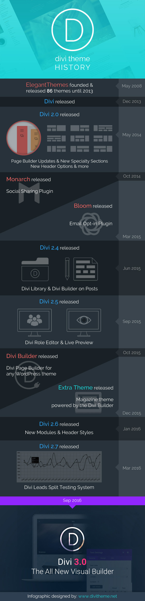

# Theme Divi

## Theme payant de Elegant Themes

https://www.elegantthemes.com/gallery/divi/

Idée: un seul thème pour tous vos projets WP

* Licence annuelle ou lifetime
* Plein de modules et de fonctionnalités
* Des modules spécialisés woocommerce
* des designs gratuits chaque mois
* de nouvelles fonctionnalités régulièrement
  * Divi AI
* Des extensions dans Divi Marketplace

### Historique

* Fin 2013: première version 
* Fin 2019: Divi 4 avec Theme Builder
* 2023: Divi AI

* 2024: Divi 5 (?)

### comparaison de volume de codes

* WP 6.4.1: 305 dossiers, 2959 fichiers
* Divi 4:23.1: 228 dossiers, 1491 fichiers

## Du No-code au Low-code

* La plupart des options des modules permettent d'obtenir le résultat obtenu en no-code
* Mais pour des cas particuliers, il est possible d'ajouter du code facilement pour compléter les besoins d'un projet
  

## Divi Marketplace

https://www.elegantthemes.com/marketplace/

https://www.elegantthemes.com/marketplace/register/

## Divi AI

* https://www.elegantthemes.com/ai/

Depuis un an, la mode avec Chat GPT et les IA génératives se répand très vite.
Elegant Themes a lancé Divi AI pour générer des pages de site web en quelques minutes.
Il faut s'abonner au service Divi AI pour l'utiliser (autour de 20 $/mois).

* Génération d'images
* Génération de textes
* Génération de code CSS
* Traduction de texte
* ...

Divi AI est un bon exemple d'intégration d'IA pour la création de sites web.

## Divi 5

En cours de développement, Divi5 est une refonte en profondeur du code de Divi pour le rendre plus performant et plus facile à maintenir.

https://www.youtube.com/watch?v=n62d3zMo1C0
